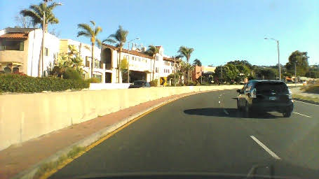

# Imitation Learning Lab


## Introduction

This lab provides an introduction to **end-to-end imitation learning for vision-only navigation** of a racetrack. Let's break that down:

* We will train a deep learning model - specifically, a *convolutional neural network* (CNN) - to regress a steering angle directly from an image taken from the front bumper of an MIT RACECAR.
* Here, "imitation learning" refers to a branch of supervised machine learning which focuses on imitating behavior from human-provided examples. In our case, we will drive a car around a track several times to provide examples for the CNN to mimic. This learning objective is also frequently termed *behavioral cloning.*
* "Vision-only" refers to using an RGB camera as the only input to the machine learning algorithm.
    * LIDAR, depth, or vehicle IMU data are not used.
* "End-to-end learning" is shorthand for the CNN's ability to regress a steering angle (i.e., an actuation for the Ackermann steering controller) from unprocessed input data (pixels). We will not need to pre-process input features ourselves, such as extracting corners, walls, floors, or optical flow data. The CNN will learn which features are important, and perform all the steps from *image processing* to *control estimation* itself ("end-to-end", loosely speaking).

We will train the model using camera data and steering angles collected from the RACECAR platform in a real-world environment, such as the basement in Stata Center, in order for the RACECAR to autonomously drive a human-defined "racetrack."

### In Stata basement:

<iframe width="560" height="315" src="https://www.youtube.com/embed/tQCZjKa3Bpw" frameborder="0" allow="accelerometer; autoplay; encrypted-media; gyroscope; picture-in-picture" allowfullscreen></iframe>

<iframe width="560" height="315" src="https://www.youtube.com/embed/SN7MkDwkLys" frameborder="0" allow="accelerometer; autoplay; encrypted-media; gyroscope; picture-in-picture" allowfullscreen></iframe>

## References

This lab and the CNN architecture we will use are based on the following resources:

* [Nvidia's blog post introducing the concept and their results](https://devblogs.nvidia.com/deep-learning-self-driving-cars/)
* [Nvidia's PilotNet paper](https://arxiv.org/pdf/1704.07911.pdf)
* [Udacity's Unity3D-based Self-Driving-Car Simulator](https://github.com/udacity/self-driving-car-sim) and [Naoki Shibuya's example](https://github.com/naokishibuya/car-behavioral-cloning) 

Several recent papers on **Imitation Learning/Behavioral Cloning** have pushed the state of the art and even demonstrated the ability to drive a full-size car in the real world in more complex scenarios. And like PilotNet, many recent robotics papers build upon the general concept of a "pixel-to-actuator" network. Below are a couple of interesting examples. These papers may provide you with ideas for extending your lab assignment to be capable of more than just estimating steering angles. See the [Tips and Suggestions](index.md#tips-and-suggestions) section for more ideas.

* [ChauffeurNet: Learning to Drive by Imitating the Best and Synthesizing the Worst](https://sites.google.com/view/waymo-learn-to-drive/)
* [VR-Goggles for Robots: Real-to-sim Domain Adaptation for Visual Control](https://sites.google.com/view/zhang-tai-19ral-vrg/home)
* [DroNet: Learning to Fly by Driving](http://rpg.ifi.uzh.ch/dronet.html)
* [Learning to Fly by Crashing](https://arxiv.org/abs/1704.05588)
* [Causal Confusion in Imitation Learning](https://arxiv.org/abs/1905.11979)
* [Variational Discriminator Bottleneck: Improving Imitation Learning, Inverse RL, and GANs by Constraining Information Flow](https://xbpeng.github.io/projects/VDB/index.html)
* [End-to-end Driving via Conditional Imitation Learning](https://arxiv.org/abs/1710.02410)
* [Monocular Plan View Networks for Autonomous Driving](https://arxiv.org/pdf/1905.06937.pdf)


## Part 1: Install required Python libraries

### `TensorFlow,` a deep-learning framework

You first need to install [miniconda](https://conda.io/miniconda.html) to install TensorFlow. Download the `Python 3.7` version of miniconda and follow the installation instructions for your platform.

<!-- Even though you will be installing `miniconda-python-3.7`, we will be using Python 2.7 to define and train the PilotNet CNN model. `miniconda-python-3.7` will handle creating a Python 2.7 environment for you. Once we save a trained model (also known as saving *weights*), we can later import the saved model in a Python 2.7 ROS environment on the RACECAR.  (To note for completeness, is also possible to train a model with Python 3 and import it with Python 2) -->


Once you have installed miniconda, clone the following repository locally:

```shell
$ git clone https://github.com/mmaz/imitation_learning_lab
$ cd imitation_learning_lab/
```

Next, we will install TensorFlow using the `conda` command. There are **two** options:

* If you **do not** have a GPU on your computer:
    
```shell
# Use TensorFlow without a GPU
$ conda env create -f environment.yml 
```
    
* Otherwise, if you **do** have a GPU:
    
```shell
# Use TensorFlow with a GPU
$ conda env create -f environment-gpu.yml
```

## Part 2: RACECAR data collection and training

In this section you will manually collect steering angle data by driving the car around. 

A good first task is to train the RACECAR to drive around some tables in a circle, before tackling a more complex course layout such as Stata basement. You can also define some more intermediate-difficulty courses (figure-eights, snake patterns, etc) to gain intuition on what types of training and validation methods are most effective.

For example, here is a third-person view of a car autonomously driving around several tables in a classroom using a trained PilotNet model:

{: style="width:50%;" }

<!-- <iframe width="560" height="315" src="https://www.youtube.com/embed/dvyEbNUAKSE" frameborder="0" allow="accelerometer; autoplay; encrypted-media; gyroscope; picture-in-picture" allowfullscreen></iframe> -->

<iframe width="560" height="315" src="https://www.youtube.com/embed/BnLihmE9o0k" frameborder="0" allow="accelerometer; autoplay; encrypted-media; gyroscope; picture-in-picture" allowfullscreen></iframe>

The following script will record images from the ZED camera on the RACECAR along with the joystick-commanded steering angle (through `teleop`):

<https://github.com/mmaz/imitation_learning_lab/blob/master/record_RACECAR.py>

In one terminal (or tmux window pane), run:

```shell
$ teleop
```

In another terminal window, start the ZED camera rostopic: `

```shell
$ roslaunch zed_wrapper zed.launch
```

Now in a third window or tmux pane:

```shell
$ python2 record_RACECAR.py
```

<!-- Make sure to use **`python2`** here for recording the images and steering angle data - note that we will **not** use `python2` in the next section to access the cameras. TensorFlow is only available in the car's `python3` environment, and ROS is only available in our `python2` environment. For recording, we do not need access to TensorFlow, only OpenCV. For autonomous driving with both TensorFlow and ROS, we will see how to work around this inconvenience in the next section via `zmq`. -->

When you are done collecting data, press `ctrl-c` to terminate collection:

<!-- After you are done with data collection, you might see an error like `TypeError: img data type = 17 is not supported` printed to the terminal when you `ctrl-c` - this is harmless and you can safely ignore this error, which happens because the last jpg was not saved to disk due to the `ctrl-c` interrupt. The rest of the jpgs should be in the saved folder along with a CSV file of jpg filenames, steering angles, and velocities. -->

After you have collected your training data, transfer the data using `scp` or a flashdrive to your laptop and train your model using [the provided jupyter notebook](https://github.com/mmaz/imitation_learning_lab/blob/master/train_RACECAR_pilotnet.ipynb).

!!! warning "Reminder"
    You should not train a model on the RACECAR itself! Use your own laptop or speak to the course instructors about potential server options.

## Part 3: Defining the PilotNet model

Let us take a closer look at the CNN architecture for PilotNet:

{: style="width:50%;" }

In this lab, we will command a fixed driving velocity and only regress steering angles from images using PilotNet. Hence, the PilotNet CNN has a single output. Using TensorFlow's *Keras API*, let us look at an implementation of the above network in code:

```python
from tensorflow.keras.layers import Lambda, Conv2D, MaxPooling2D, Dropout, Dense, Flatten
from tensorflow.keras.models import Sequential

# you will need to crop or shrink images to the dimensions you choose here:
IMAGE_HEIGHT, IMAGE_WIDTH, IMAGE_CHANNELS = 66, 200, 3
INPUT_SHAPE = (IMAGE_HEIGHT, IMAGE_WIDTH, IMAGE_CHANNELS)

def build_model(dropout_rate=0.5):
    model = Sequential()
    model.add(Lambda(lambda x: x/127.5-1.0, input_shape=INPUT_SHAPE)) #normalizes image data
    model.add(Conv2D(24, (5,5), strides=(2, 2), activation='elu'))
    model.add(Conv2D(36, (5,5), strides=(2, 2), activation='elu'))
    model.add(Conv2D(48, (5,5), strides=(2, 2), activation='elu'))
    model.add(Conv2D(64, (3,3), activation='elu'))
    model.add(Conv2D(64, (3,3), activation='elu'))
    model.add(Dropout(dropout_rate)) 
    model.add(Flatten())
    model.add(Dense(100, activation='elu'))
    model.add(Dense(50, activation='elu'))
    model.add(Dense(10, activation='elu'))
    model.add(Dense(1))
    model.summary()
    return model
```

!!! note
    Note that Keras will disable **Dropout regularization** at inference time. [See here](https://stackoverflow.com/questions/47787011/how-to-disable-dropout-while-prediction-in-keras) for details.

As configured above, the PilotNet CNN model expects 200x66 crops from the car's camera.

!!! note "Check your understanding"
    How many trainable parameters are in this model? What is the output volume of each layer?
    
    What is the effect of changing the input size on the total number of parameters in the model?  
    
    **Hint 1:** use `model.summary()` to print out a summary of the network. 

    **Hint 2:** Consider the input to the flattening operation and first dense layer: it is the output volume from the last convolutional layer. How is this affected by changing the input size? What about the next dense layer?
    
    Notice that we normalize the input images in the first layer between (-1,1) Why would we prefer this range?

    **Hint:** Consider the shape, domain, and range of common activation functions.

For more on TensorFlow's Keras API, [read their documentation here](https://tensorflow.org). Remember to change the documentation version to match the version of tensorflow you are using, which you can determine by running the following snippet in a python interpreter:

```python
$ python3
>>> import tensorflow as tf
>>> tf.__version__
'1.14.0'
```


### Model Output and Optimization

The output of this model is a single neuron, which corresponds to the servo or steering angle to command the car with. We will use the [Adam optimizer](https://www.tensorflow.org/api_docs/python/tf/train/AdamOptimizer) with a loss function (i.e., cost or objective function) that minimizes the mean square error betwen the ground-truth steering angles and the currently predicted steering angles:

```python
model = build_model()
model.compile(loss='mean_squared_error', optimizer=Adam(lr=1.0e-4))
```

!!! note "Optional Exercise"
    With only a few changes to the above model and loss definitions, you can add a second output to estimate the velocity as well. This might help your team to complete the course faster! For instance, when you are collecting training data, you might want to drive quickly down straight hallways and slow down during turns. It is feasible for a model to learn to imitate this behavior.

## Part 4: Training the Model

We will now train a model using our collected training data, in a Jupyter Notebook. To open the notebook:

```shell
$ conda activate imitation_learning
(imitation_learning) $ cd imitation_learning_lab
(imitation_learning) $ jupyter notebook
```

Then, open [train_RACECAR_pilotnet.ipynb](https://github.com/mmaz/imitation_learning_lab/blob/master/train_RACECAR_pilotnet.ipynb) in your browser.

### Train/Validation Split

!!! danger "Regularization"
    With enough training time and enough model parameters, you can perfectly fit your training data! This is called **overfitting** - we will use validation data, image augmentation, and regularization to avoid overfitting.

We will partition our data into training and validation sets. Validation helps to ensure your model is not overfitting on the training data. In the notebook, observe the use of `from sklearn.model_selection import train_test_split.`

```python
TEST_SIZE_FRACTION = 0.2
SEED = 56709 # a fixed seed can be convenient for experiment repeatability

X_train, X_valid, y_train, y_valid = train_test_split(
    imgs, 
    angles_rad, 
    test_size=TEST_SIZE_FRACTION, 
    random_state=SEED)
```

### Batch Generation, Checkpointing, and Training Execution

For efficient training on a GPU, multiple examples are sent at once in a *batch* onto the GPU in a single copy operation, and the results of backpropagation are returned from the GPU back to the CPU. You will want to checkpoint your model after each epoch of training. Lastly, `model.fit_generator()` will commence training on your data and display the current loss on your training and testing data:

```python
checkpoint = ModelCheckpoint('imitationlearning-{epoch:03d}.h5',
                             monitor='val_loss',
                             verbose=0,
                             save_best_only=False,
                             mode='auto')

def batch_generator(image_paths, steering_angles, batch_size):
    """
    Generate training image give image paths and associated steering angles
    """
    images = np.empty([batch_size, IMAGE_HEIGHT, IMAGE_WIDTH, IMAGE_CHANNELS])
    steers = np.empty(batch_size)
    while True:
        i = 0
        for index in np.random.permutation(len(image_paths)):

            ##############################################
            # TODO: add your augmentation code here   ####
            ##############################################
            
            image = cv.imread(image_paths[index])
            cropped = image[95:-95, 128:-127, :]
            images[i] = cropped
            
            steering_angle = steering_angles[index]
            steers[i] = steering_angle
            
            i += 1
            if i == batch_size:
                break
        yield images, steers
        
        
BATCH_SIZE=20
model.fit_generator(generator=batch_generator(X_train, y_train, batch_size=BATCH_SIZE),
                    steps_per_epoch=20000,
                    epochs=10,
                    validation_data=batch_generator(X_valid, y_valid, batch_size=BATCH_SIZE),
                    # https://stackoverflow.com/a/45944225
                    validation_steps=len(X_valid) // BATCH_SIZE, 
                    callbacks=[checkpoint],
                    verbose=1)
```

### Image Augmentation

You may want to add some data augmentation to help your model generalize past the specific examples you have collected. Some example transformations to incorporate: brightness variation, gamma varation, aspect ratio changes, random shadows/noise, etc. See the training notebook for some example augmentation functions.

### Servo histograms

It is important to ensure the train/test split of the data you collected has similar driving conditions represented. For instance, here is the histogram of servo angles in the training and testing data used in Stata basement:


### [Optional] Extending to more general environments

It is possible to train a model with driving data from public roads, in order to experiment with how it affects the performance of your car in Stata basement.


!!! danger
    Obviously, you should not test anything on public roads yourself, either on a RACECAR or any other car. Be safe and responsible!




You can find useful public road data from Udacity here: <https://github.com/udacity/self-driving-car/tree/master/datasets>

Another useful public road dataset is here: <https://github.com/SullyChen/driving-datasets>

<!--  -->


## Part 5: Running inference on RACECAR

!!! note
    We use `zmq`, a common messaging framework, to send camera images from a Python2-ROS script, to a Python3 script running inference with TensorFlow and estimating steering angles, back to a Python2-ROS script that commands the car to drive.

To execute a trained model, you will need to run the following scripts:

1. [`zed_RACECAR.py`](https://github.com/mmaz/imitation_learning_lab/blob/master/zed_RACECAR.py)
1. [`infer_RACECAR.py`](https://github.com/mmaz/imitation_learning_lab/blob/master/infer_RACECAR.py)
1. [`drive_RACECAR.py`](https://github.com/mmaz/imitation_learning_lab/blob/master/drive_RACECAR.py)


You will first need to copy your saved model weights to the RACECAR (e.g., using SCP). You will specify the model location using [this command-line argument](https://github.com/mmaz/imitation_learning_lab/blob/741a9e32ffa3bff84224706e0d06acc32b0b7070/infer_RACECAR.py#L45).

Begin by running `teleop` and `roslaunch zed_wrapper zed.launch` in the background.

Then, to start inference, in one terminal, run:

```shell
$ python3 infer_RACECAR.py --model path_to_model.h5
```

Ensure you are using **python3** above. In another terminal, use **python2** and run:

```shell
$ python2 drive_RACECAR.py
```

And in a third terminal, start the camera feed with:

```shell
$ python2 zed_RACECAR.py
```

!!! note "Optional exercise"
    This script also includes a mean filter. You can remove this, extend or shorten the length of the mean filter, change it to a median filter, etc, to experiment with inference behavior while driving.


[visualize_drive.ipynb](https://github.com/mmaz/imitation_learning_lab/blob/master/visualize_drive.ipynb) can be used to overlay steering angle predictions on top of saved runs (see `infer_RACECAR.py` for a flag that saves images during inference):

<iframe width="560" height="315" src="https://www.youtube.com/embed/o0I6_YiL0X4" frameborder="0" allow="accelerometer; autoplay; encrypted-media; gyroscope; picture-in-picture" allowfullscreen></iframe>


## Tips and Suggestions

If you are having diffuclty training a working model, or are looking for ideas for improvement, here are some suggestions:

1. Visualize your model's predictions by saving the center camera images when you are testing a model (you can use the [`SAVE_RUN`](https://github.com/mmaz/imitation_learning_lab/blob/2ebcd9140e34ca2e2283496a84ea4e47c8979788/infer_RACECAR.py#L21) flag) and incorporate some of the code snippets from [visualize_drive.ipynb](https://github.com/mmaz/imitation_learning_lab/blob/master/visualize_drive.ipynb). 
    * Are the model outputs noisy (i.e., are the predicted angles jumping around a lot)? Try using the mean or median filter in `infer_RACECAR.py`. 
    * Are the inference angles wrong? Find some images in your training data that come from a similar point in the track where your inferred angles are wrong - how do the model's predictions look there on the training data? If they are also bad, you can try to collect more data in that spot on the track (for instance, you can reset the car to the starting position of a corner several times and record several turns).
    * In addition to visualizing the model's predictions on that section of the track in your training data, also inspect the images and steering angles in the CSV at that point in the track - maybe the car was not being driven smoothly at that location when collecting training data.
1. The dimensions of the model inputs will have a significant impact on the model's accuracy, speed of evaluation (i.e., can you run inference with the model at 30FPS, 15FPS, etc.), and training time/data required (a larger input creates more parameters which may take more training time).
    * How large of an input will you use? The original resolution of the camera frame? Or will you downscale the images?
    * How much will you crop out of the input images? You can choose vertical or horizontal amounts independently of each other. Or you can try using the full camera frame.
    * The number of distinct, unique visual features at each point in the track (i.e., higher input resolutions and larger crops of each frame will include more details from the walls, ceiling, and floor) used when training the model will impact how well the model can memorize the correct steering output to predict at that point in the track during inference, but this will require more training time and data. Smaller inputs can help make the model more robust and generalizable, and reduce the amount of training time. 
1. Make sure you can train a model that works on a smaller environment (e.g., around a couple of tables or around a classroom) before tackling an environment such as the full Stata basement loop. 
1. Remember: the training and validation errors are not a great indicator of how well the model wll drive, compared to testing model variants on the car. They are a better indicator of whether the model is continuing to fit (i.e., "learn").
1. Be wary of overfitting: try multiple saved checkpoints instead of just the last one (a checkpoint is saved every epoch). You can shorten the number of training steps per epoch and increase the number of epochs to have more models to try out. You can try a larger batch size on the server too. 
1. Try to plan multiple training experiments ahead of time. Instead of changing one hyperparameter, training a model and testing, and going back to change another hyperparameter, try to train several models with different hyperparameters in one session and copy them all over to your racecar.
    * Moreover, if you are using the [`SAVE_RUN`](https://github.com/mmaz/imitation_learning_lab/blob/2ebcd9140e34ca2e2283496a84ea4e47c8979788/infer_RACECAR.py#L21) flag, you can try visualizing predictions from all your model variants on the same saved run - you might find another trained model or saved epoch is doing better than the one you were using for testing.
    * The simplistic image augmentation strategies provided might lower model performance in certain conditions, thus you should also train a model with augmentation disabled, and test both. (This is of course not a general rule. The interested reader is encouraged to explore current research on augmentation techniques, such as [Population-Based Augmentation](https://bair.berkeley.edu/blog/2019/06/07/data_aug/).)
1. You can try adding different strategies for model regularization (e.g., weight decay, more dropout, or batchnorm layers) to avoid overfitting. You might also try to decrease the learning rate (you will need to train for longer) - if the learning rate is too high, the model will coverge too quickly. You might also choose to experiment with different activation types (ReLU, ELU, Tanh, Sigmoid, ...) since they have different characteristics with respect to backprop.
    * See [this chaper of Neural Networks and Deep Learning](http://neuralnetworksanddeeplearning.com/chap3.html) for a useful introduction to regularization.
1. With x-forwarding to view the live camera stream, or when copying training data from the RACECAR to your laptop or a server, connecting to the car's router via Ethernet will probably be faster than connecting over WiFi. If you do need to stream or copy data over WiFi, try to use the 5GHz network which will probably be faster.
1. One powerful regularization/generalization technique for training neural networks is [multi-task learning](https://en.wikipedia.org/wiki/Multi-task_learning). A crude version of this approach might be to add a second output to the network which predicts velocities (which is also being saved in your CSV). It is optional whether you choose to command the model's predicted velocities or continue to command a fixed speed (the current behavior of `drive_RACECAR.py`) when running inference - the benefits to model regularization may still be gained from this change. However, this will likely require more training data.
1. See the cited papers in the [References](index.md#references) section to find many more ideas for improvement. One place to start is by reading [Nvidia's PilotNet paper](https://arxiv.org/pdf/1704.07911.pdf) and papers which have cited it (e.g., using Google Scholar) for some ideas (often in methodology sections, and future work discussions). 
    * Note that the PilotNet paper uses multiple cameras (albeit at different angles). You might try utilizing both the left and right images from the ZED stereo camera, or even the computed depth image, instead of only using one of the cameras.
